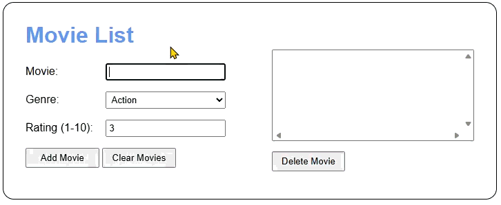
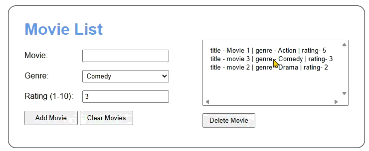
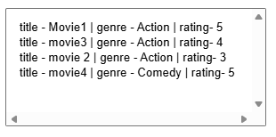

# 📌 Movie Tracker CHs 11/12/13
### 👤 Author
- Ethan McEvoy (https://github.com/EMcE01)

---

## 📚 Table of Contents
- [📖 Project Overview](#-project-overview--summary)
- [🧰 Tech Stack](#-tech-stack)
- [🛠 Development Tools](#-development-tools)
- [💡 Core Concepts](#-core-concept--new-concepts)
- [✨ Features](#-features)
- [🖼 Visual Aids](#-visual-aids-screenshots--gifs--reports--data-input--output)
- [🧠 Reflection](#-reflection-what-i-learned)

---

## 📖 Project Overview / Summary
> 🔝 [Back to TOC](#-table-of-contents)

This program allows users to enter in movies along with their genre and rating. It
then displays those movies in order of rating descending while grouping up movies with 
the same genre. 

---

## 🧰 Tech Stack
> 🔝 [Back to TOC](#-table-of-contents)

| Category       | Technology Used |
|----------------|----------------|
| Frontend       | HTML, CSS|
| Backend        | JavaScript|

---

## 🛠 Development Tools
> 🔝 [Back to TOC](#-table-of-contents)

| Tool | Purpose |
|------|--------|
| WebStorm | Primary Code editor |
| VS Code | Code editor |
| GitHub | Version control |
| Chrome DevTools | Debugging |

---

## 💡 Core Concept / New Concepts
> 🔝 [Back to TOC](#-table-of-contents)

Highlight key concepts learned or applied:

- 📌 Modules – This was my first experience using modules to perform different tasks.
- 📌 Refactoring – I was given starter code and told to rename files, classes, and variables to make them better fit the assignment criterium.
- 📌 JSDocs – This was my first program putting in extra effort toward documenting.
  
---

## ✨ Features
> 🔝 [Back to TOC](#-table-of-contents)

- ✅ Data Storage – Stored data in local storage 
- ✅ Data Retreiving – Retreived data from local storage  
- ✅ Data Sorting – Sorted data by genre and rating  

---

## 🖼 Visual Aids: Screenshots / GIFs / Reports / Data Input & Output
> 🔝 [Back to TOC](#-table-of-contents)

## Adding A Movie

## Deleting and Clearing

## How it sorts

---

## 🧠 Reflection: What I Learned
> 🔝 [Back to TOC](#-table-of-contents)

This assignment showed me how important documentation is as I struggled 🧩 with refactoring. As I would rename the files, the variables and classes were changed for me. However, some variables were not meant to be changed. Having the documentation to look at helped me substantially. I feel that I impproved 🚀 on many skills such as the documentation as well as this readMe. Overall, this assignment taught me just how easy it can be to take an old project and revamp it to meet my new needs. While also showing me that it may not always be the simplest option if the previous project has a lot to alter. 

---
